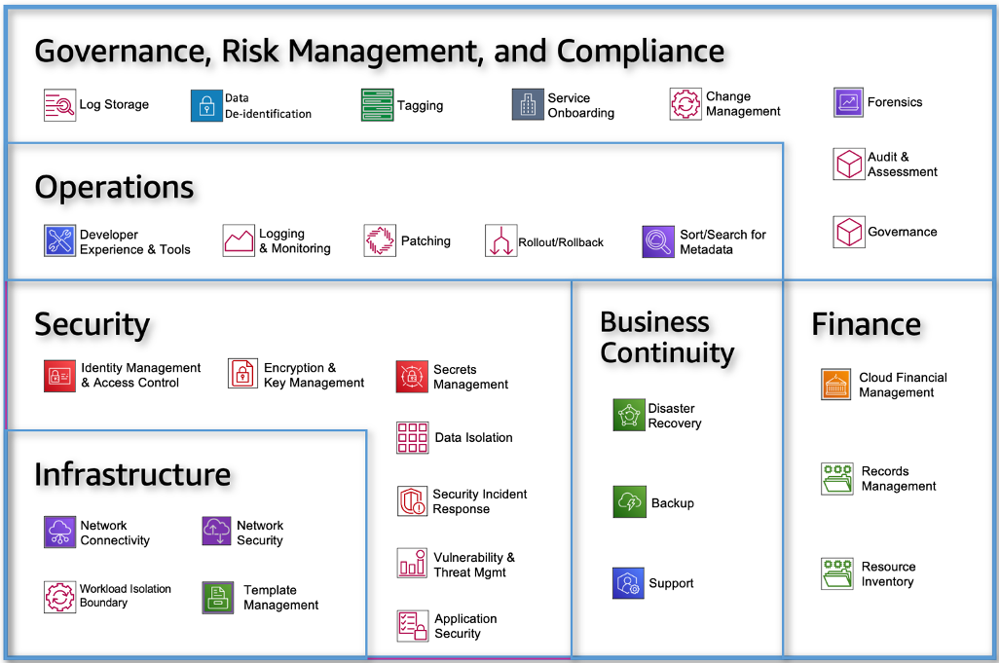

AWS

when deciding a Region to use you should consider the following:

compliance, latency, pricing, service availability.

**Organizing multiple aws accounts**

Multiple aws accounts help isolate and manage your business application and data can help you optimize across most of the aws Well-Architected Framework pillars including operational  excellence, security, reliability, and cost optimization.

An account acts as an identity and access management isolation boundary. when you need to share resources and data between two accounts, you must explicitly allow access.

Stages of Cloud adoption

Foundational stage of cloud adoption. where you invest in improving your cloud foundational capabilities before greatly expanding adoption.

Cloud Foundation Capabilities Categories:

- Governance, RIsk, and Compliance
- Security
- Operations {*The decommissioning process}
- Infrastructure
- Finance
- Business Continuity

Benefits of using multiple AWS accounts

- Group workloads based on business purpose and ownership {align ownership and decision making with those accounts and avoids dependencies and conflicts with how workloads in other accounts are secured and managed.} {difference in processes of different product teams}
- Apply distinct security controls by environment{non-prod and prod}
- Constrain access to sensitive data
- Promote innovation and agility.{sandbox and development account}
- Limit scope of impact form adverse events
- support multiple IT operating models{divide responsibilities across diff teams i.e cloudops and devops}
- Manage Costs{an account is the default means by which AWS costs are allocated}
- Distribute AWS service Quotas and API request rate limits{Service Quotas and request limits are allocated for each account}

Core concepts for defining multi-account strategy

1. AWS Organizations governs your environment{central logging, optimize costs and simplified billing, secure and audit environment for compliance, control access to accounts and services, centrally provision accounts and resources} as you scale your workloads. Each organization consists of:
    - management account {The management account creates the AWS organization’s resources, OUs, and policies, to manage the organization’s member accounts}
    - zero or more member accounts
    - zero or more organizational units(OU){An organizational unit (OU) provides a means to group accounts within a root.An OU can also contain other OUs. When you attach a policy to one of the nodes in the hierarchy, it flows down and affects all the branches (OUs) and leaves (accounts) beneath it}
    - zero or more policies
2. Benefits of Using OUs
3. Multiple Organizations